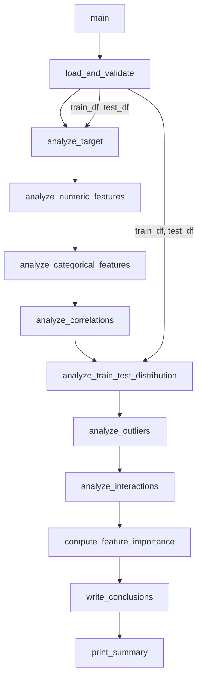

# Design Document — Heart Disease EDA

## Overview

`eda.py` es un script Python standalone y reproducible que ejecuta un análisis exploratorio completo sobre los datos de la competición Kaggle Playground Series S6E2. El script carga los datos, valida su integridad, genera 15 visualizaciones PNG, calcula estadísticas y tests estadísticos, entrena un modelo preliminar para importancia de features, y escribe un archivo `conclusions.md` con los hallazgos estructurados.

El diseño prioriza:
- **Reproducibilidad**: semilla fija (`random_state=42`) en todos los modelos y operaciones estocásticas.
- **Modularidad**: cada requirement se implementa como una función independiente con responsabilidad única.
- **Trazabilidad**: cada función escribe directamente a `conclusions.md` y guarda sus imágenes en `eda_outputs/`.
- **Robustez**: manejo explícito de nombres de columnas con espacios mediante renombrado al cargar.

---

## Architecture

El script sigue un flujo lineal secuencial. No hay estado global mutable; los datos se pasan explícitamente entre funciones.



**Flujo de datos:**
1. `load_and_validate` retorna `(train_df, test_df)` con columnas renombradas (snake_case) y target codificado.
2. Cada función analítica recibe los DataFrames, genera imágenes y retorna un dict de hallazgos.
3. `write_conclusions` recibe todos los dicts de hallazgos y escribe `conclusions.md`.

---

## Components and Interfaces

### Constantes globales

```python
TRAIN_PATH = "playground-series-s6e2/train.csv"
TEST_PATH  = "playground-series-s6e2/test.csv"
OUTPUT_DIR = "eda_outputs"
RANDOM_STATE = 42

# Mapeo de nombres originales (con espacios) a snake_case
COL_RENAME = {
    "Heart Disease":          "target",
    "Age":                    "age",
    "Sex":                    "sex",
    "Chest pain type":        "chest_pain_type",
    "BP":                     "bp",
    "Cholesterol":            "cholesterol",
    "FBS over 120":           "fbs_over_120",
    "EKG results":            "ekg_results",
    "Max HR":                 "max_hr",
    "Exercise angina":        "exercise_angina",
    "ST depression":          "st_depression",
    "Slope of ST":            "slope_of_st",
    "Number of vessels fluro":"num_vessels_fluro",
    "Thallium":               "thallium",
}

NUMERIC_FEATURES  = ["age", "bp", "cholesterol", "max_hr", "st_depression"]
CATEGORICAL_FEATURES = [
    "sex", "chest_pain_type", "fbs_over_120", "ekg_results",
    "exercise_angina", "slope_of_st", "num_vessels_fluro", "thallium"
]
ALL_FEATURES = NUMERIC_FEATURES + CATEGORICAL_FEATURES
```

### Funciones principales

| Función | Inputs | Outputs | Imagen(es) |
|---|---|---|---|
| `load_and_validate(train_path, test_path)` | rutas CSV | `(train_df, test_df)` | — |
| `analyze_target(train_df)` | train_df | dict hallazgos | `01_target_distribution.png` |
| `analyze_numeric_features(train_df)` | train_df | dict hallazgos | `02_numeric_distributions.png`, `03_numeric_boxplots.png` |
| `analyze_categorical_features(train_df)` | train_df | dict hallazgos | `04_categorical_vs_target.png` |
| `analyze_correlations(train_df)` | train_df | dict hallazgos | `05_correlation_heatmap.png`, `06_spearman_correlations.png` |
| `analyze_train_test_distribution(train_df, test_df)` | ambos dfs | dict hallazgos | `07_train_test_distribution.png` |
| `analyze_outliers(train_df)` | train_df | dict hallazgos | `08_violin_plots.png` |
| `analyze_interactions(train_df)` | train_df | dict hallazgos | `09_pairplot.png`, `10_age_vs_maxhr.png`, `11_stdep_vs_maxhr.png`, `12_top_pair_1/2/3.png` |
| `compute_feature_importance(train_df)` | train_df | dict hallazgos | `13_feature_importance_rf.png` |
| `write_conclusions(output_dir, findings)` | dir + dict | `conclusions.md` | — |

### Firma de `load_and_validate`

```python
def load_and_validate(train_path: str, test_path: str) -> tuple[pd.DataFrame, pd.DataFrame]:
    """
    Carga CSVs, renombra columnas a snake_case, codifica target (Presence=1, Absence=0).
    Imprime shape, dtypes, head(5), nulos y duplicados.
    """
```

### Firma de `write_conclusions`

```python
def write_conclusions(output_dir: str, findings: dict) -> None:
    """
    Escribe eda_outputs/conclusions.md con secciones estructuradas.
    findings es un dict con claves: target, numeric, categorical,
    correlations, train_test, outliers, feature_importance.
    """
```

---

## Data Models

### DataFrame post-carga

Tras `load_and_validate`, ambos DataFrames tienen el esquema:

| Columna | Dtype | Notas |
|---|---|---|
| `id` | int64 | Identificador, no usado en análisis |
| `age` | int64 | |
| `sex` | int64 | 0/1 |
| `chest_pain_type` | int64 | 1–4 |
| `bp` | int64 | Valores 0 son anómalos |
| `cholesterol` | int64 | Valores 0 son anómalos |
| `fbs_over_120` | int64 | 0/1 |
| `ekg_results` | int64 | 0/1/2 |
| `max_hr` | int64 | |
| `exercise_angina` | int64 | 0/1 |
| `st_depression` | float64 | Único float |
| `slope_of_st` | int64 | 1–3 |
| `num_vessels_fluro` | int64 | 0–3 |
| `thallium` | int64 | 3/6/7 |
| `target` | int64 | Solo en train: 1=Presence, 0=Absence |

### Dict de hallazgos (`findings`)

```python
findings = {
    "target": {
        "counts": pd.Series,          # conteo por clase
        "pct_minority": float,        # % clase minoritaria
        "is_imbalanced": bool,        # True si < 40%
    },
    "numeric": {
        "descriptive_stats": pd.DataFrame,
        "zero_counts": dict,          # {feature: count} para bp, cholesterol
    },
    "categorical": {
        "chi2_pvalues": dict,         # {feature: p_value}
        "presence_rates": dict,       # {feature: pd.Series}
    },
    "correlations": {
        "pearson_matrix": pd.DataFrame,
        "spearman_target": pd.Series, # ordenada por |corr| desc
        "top3_features": list[str],
    },
    "train_test": {
        "ks_results": dict,           # {feature: {"statistic": float, "pvalue": float}}
        "problematic_features": list[str],
    },
    "outliers": {
        "outlier_counts": dict,       # {feature: {"count": int, "pct": float}}
    },
    "feature_importance": {
        "importances": pd.Series,     # ordenada desc
        "cv_roc_auc_mean": float,
        "cv_roc_auc_std": float,
    },
}
```

---

## Correctness Properties

*A property is a characteristic or behavior that should hold true across all valid executions of a system — essentially, a formal statement about what the system should do. Properties serve as the bridge between human-readable specifications and machine-verifiable correctness guarantees.*

### Property 1: Codificación binaria del target

*For any* fila del `Train_Dataset`, después de `load_and_validate`, el valor de la columna `target` SHALL ser exactamente 0 o 1, y la suma de valores `target==1` SHALL ser igual al conteo original de filas con `Heart Disease == "Presence"`.

**Validates: Requirements 1.5**

### Property 2: Completitud de imágenes generadas

*For any* ejecución completa de `eda.py`, el número de archivos `.png` en `eda_outputs/` SHALL ser exactamente 15.

**Validates: Requirements 10.4**

### Property 3: Detección de ceros anómalos

*For any* dataset donde `bp` o `cholesterol` contengan valores iguales a 0, el dict `findings["numeric"]["zero_counts"]` SHALL reportar un conteo mayor que 0 para esa feature.

**Validates: Requirements 3.4**

### Property 4: Consistencia de outliers IQR

*For any* feature numérica, el conteo de outliers reportado SHALL ser igual al número de filas donde el valor está fuera de `[Q1 - 1.5*IQR, Q3 + 1.5*IQR]`.

**Validates: Requirements 7.1, 7.2**

### Property 5: Marcado de features con drift

*For any* feature numérica cuyo test KS tenga p-value < 0.05, esa feature SHALL aparecer en `findings["train_test"]["problematic_features"]`.

**Validates: Requirements 6.3**

### Property 6: Ordenación de correlaciones Spearman

*For any* conjunto de features, la lista `findings["correlations"]["spearman_target"]` SHALL estar ordenada de mayor a menor por valor absoluto de correlación con el target.

**Validates: Requirements 5.3, 10.2**

### Property 7: Selección de top pares por correlación

*For any* DataFrame con features numéricas, los 3 pares seleccionados por `analyze_interactions` SHALL tener correlación absoluta de Spearman mayor o igual que cualquier otro par elegible (excluyendo los pares fijos `(age, max_hr)` y `(st_depression, max_hr)`).

**Validates: Requirements 8.4**

---

## Error Handling

| Situación | Comportamiento |
|---|---|
| Archivo CSV no encontrado | `FileNotFoundError` con mensaje descriptivo indicando la ruta esperada |
| `eda_outputs/` no existe | Se crea automáticamente con `os.makedirs(OUTPUT_DIR, exist_ok=True)` al inicio |
| Columna esperada ausente en CSV | `KeyError` con mensaje indicando qué columna falta |
| Dataset vacío tras carga | `ValueError: Train dataset is empty` |
| `RandomForestClassifier` con datos insuficientes | Capturado con try/except, se reporta en conclusions sin abortar el script |

Todas las funciones analíticas son independientes: un fallo en una no interrumpe las demás (cada una tiene su propio try/except que loguea el error y continúa).

---

## Testing Strategy

### Enfoque general

El EDA es un script de análisis con efectos secundarios (I/O: imágenes, archivos de texto, consola). La lógica pura testeable se concentra en:
- Transformaciones de datos (codificación del target, renombrado de columnas)
- Cálculos estadísticos (IQR, KS, correlaciones)
- Lógica de clasificación (detección de ceros anómalos, marcado de features problemáticas)

### Tests unitarios (pytest)

Se implementan en `tests/test_eda.py` con fixtures de DataFrames sintéticos pequeños:

```
tests/
└── test_eda.py
```

Casos de prueba concretos:
- `test_target_encoding`: verifica que `Presence` → 1 y `Absence` → 0
- `test_zero_anomaly_detection`: verifica que `bp=0` y `cholesterol=0` se reportan
- `test_ks_flagging`: verifica que features con p-value KS < 0.05 se marcan como problemáticas
- `test_outlier_count_iqr`: verifica que el conteo IQR es correcto con datos conocidos
- `test_spearman_ordering`: verifica que la serie de correlaciones está ordenada por |valor| desc
- `test_output_image_count`: verifica que tras ejecutar el script completo con datos reales se generan exactamente 15 PNGs

### Tests de propiedades (pytest + Hypothesis)

Se usan para las propiedades 1–6 definidas arriba. Cada test genera DataFrames aleatorios con Hypothesis y verifica la propiedad universal.

```python
# Ejemplo — Property 1
from hypothesis import given, settings
import hypothesis.strategies as st

@given(st.lists(st.sampled_from(["Presence", "Absence"]), min_size=1, max_size=1000))
@settings(max_examples=100)
def test_target_encoding_property(labels):
    # Feature: heart-disease-eda, Property 1: target encoding preserves counts
    df = pd.DataFrame({"Heart Disease": labels})
    result = encode_target(df)
    assert set(result["target"].unique()).issubset({0, 1})
    assert (result["target"] == 1).sum() == labels.count("Presence")
```

Propiedades cubiertas con PBT:
- **Property 1** — codificación binaria del target
- **Property 3** — detección de ceros anómalos
- **Property 4** — consistencia de outliers IQR
- **Property 5** — marcado de features con drift KS
- **Property 6** — ordenación de correlaciones Spearman
- **Property 7** — selección de top pares por correlación

Property 2 (conteo de imágenes) se verifica con un test de integración de ejemplo único, no con PBT, ya que es una verificación de I/O determinista.

**Configuración PBT**: mínimo 100 iteraciones por propiedad (`max_examples=100`).
**Tag format**: `# Feature: heart-disease-eda, Property N: <texto>`

### Tests de integración

- Ejecutar `eda.py` completo sobre los datos reales y verificar:
  - Existencia de los 15 PNGs en `eda_outputs/`
  - Existencia de `eda_outputs/conclusions.md` con las 9 secciones requeridas
  - Salida de consola con ruta y conteo de imágenes
