# EDA Conclusions — Heart Disease Prediction

> Kaggle Playground Series S6E2 · Binary classification · Metric: ROC AUC

---

## 1. Overview

Dataset contains **630,000** training samples with 13 clinical features (5 numeric, 8 categorical) and a binary target (`Heart Disease`: Presence / Absence).

---

## 2. Class Balance

| Class | Count | % |
|---|---|---|
| Absence (0) | 347,546 | 55.2% |
| Presence (1) | 282,454 | 44.8% |

Mild imbalance — no aggressive resampling needed, but `scale_pos_weight` or `class_weight` may help.

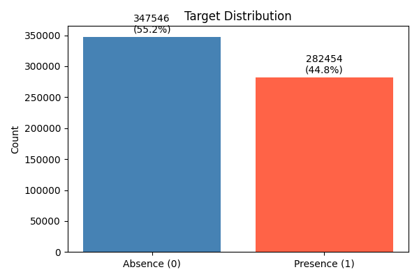

---

## 3. Numeric Features

### Descriptive Statistics

```
                     mean  median        std    min    max    p25    p75
age             54.136706    54.0   8.256301   29.0   77.0   48.0   60.0
bp             130.497433   130.0  14.975802   94.0  200.0  120.0  140.0
cholesterol    245.011814   243.0  33.681581  126.0  564.0  223.0  269.0
max_hr         152.816763   157.0  19.112927   71.0  202.0  142.0  166.0
st_depression    0.716028     0.1   0.948472    0.0    6.2    0.0    1.4
```

- `bp` and `cholesterol` have **no zero values** — no imputation needed.
- `st_depression` is right-skewed (median 0.1, max 6.2) — consider log transform.

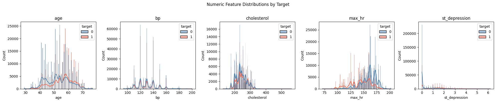

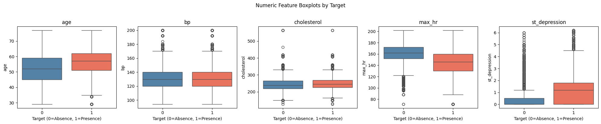

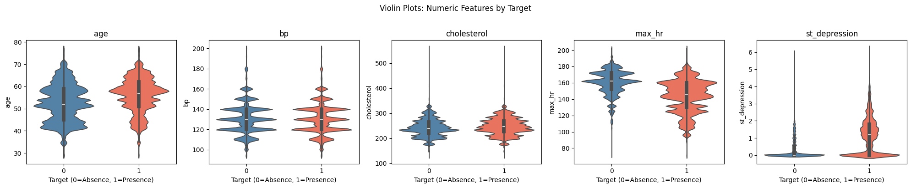

---

## 4. Categorical Features

All 8 categorical features are **statistically significant** predictors (chi-squared test, all p ≈ 0).

| Feature | p-value | Significant? |
|---|---|---|
| sex | 0.0000e+00 | ✓ |
| chest_pain_type | 0.0000e+00 | ✓ |
| fbs_over_120 | 2.28e-156 | ✓ |
| ekg_results | 0.0000e+00 | ✓ |
| exercise_angina | 0.0000e+00 | ✓ |
| slope_of_st | 0.0000e+00 | ✓ |
| num_vessels_fluro | 0.0000e+00 | ✓ |
| thallium | 0.0000e+00 | ✓ |

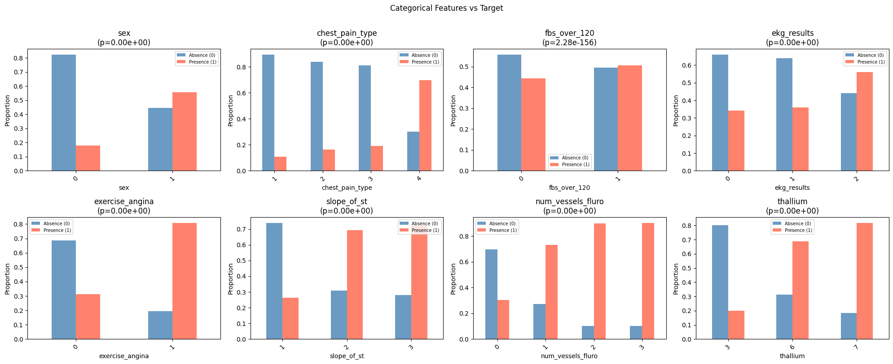

---

## 5. Correlations

**Top 3 features by |Spearman ρ| with target:** `thallium`, `chest_pain_type`, `num_vessels_fluro`

| Feature | Spearman ρ |
|---|---|
| thallium | 0.6050 |
| chest_pain_type | 0.5089 |
| num_vessels_fluro | 0.4627 |
| exercise_angina | 0.4419 |
| max_hr | -0.4410 |
| st_depression | 0.4305 |
| slope_of_st | 0.4271 |
| sex | 0.3424 |
| ekg_results | 0.2190 |
| age | 0.2167 |
| cholesterol | 0.0912 |
| fbs_over_120 | 0.0336 |
| bp | 0.0008 |

`bp` and `fbs_over_120` are the weakest predictors — consider dropping or monitoring their importance.

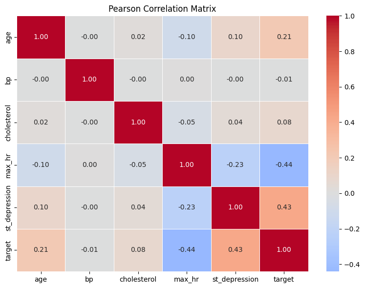

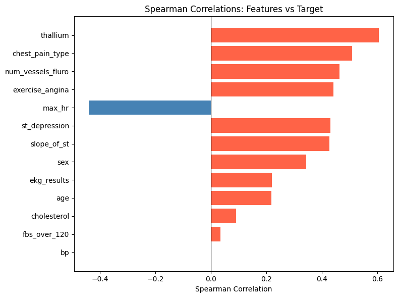

---

## 6. Bivariate Analysis

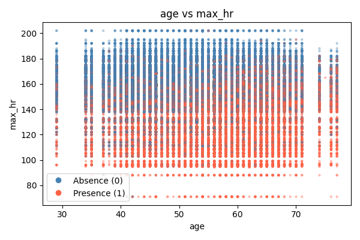

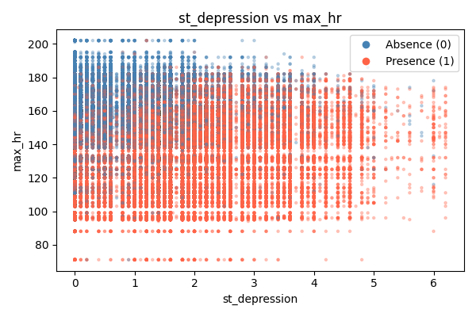

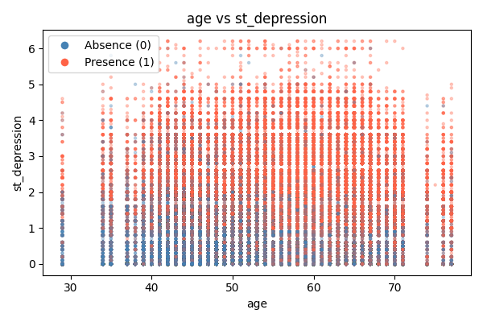

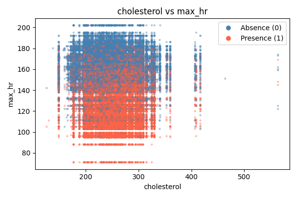

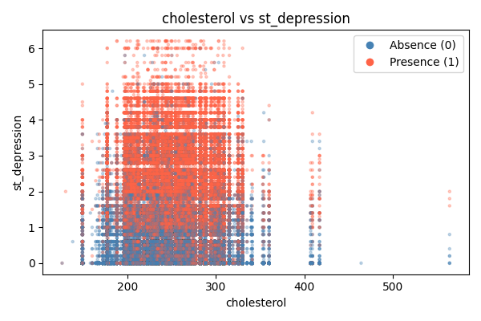

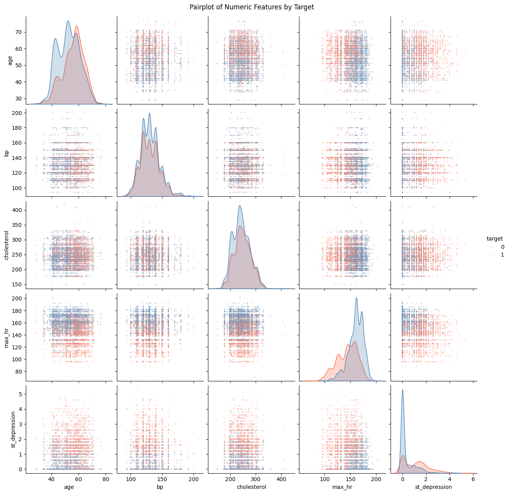

---

## 7. Train-Test Distribution Shift

KS test shows **no significant shift** across all numeric features (all p ≥ 0.05). Train and test come from the same distribution — no domain adaptation needed.

| Feature | KS Statistic | p-value | Problematic? |
|---|---|---|---|
| age | 0.0022 | 0.3393 | No |
| bp | 0.0023 | 0.2569 | No |
| cholesterol | 0.0014 | 0.8546 | No |
| max_hr | 0.0017 | 0.6182 | No |
| st_depression | 0.0026 | 0.1641 | No |

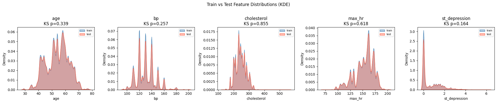

---

## 8. Outliers

Low outlier rates — tree-based models handle these natively. For linear/distance models, apply RobustScaler or winsorize at 1st/99th percentile.

| Feature | Count | % |
|---|---|---|
| age | 1,048 | 0.17% |
| bp | 9,011 | 1.43% |
| cholesterol | 2,194 | 0.35% |
| max_hr | 14,246 | 2.26% |
| st_depression | 9,971 | 1.58% |

---

## 9. Feature Importance (Random Forest baseline)

**CV ROC AUC (5-fold): 0.9470 ± 0.0007**

| Feature | Importance |
|---|---|
| thallium | 0.1796 |
| chest_pain_type | 0.1494 |
| max_hr | 0.1290 |
| cholesterol | 0.0870 |
| age | 0.0757 |

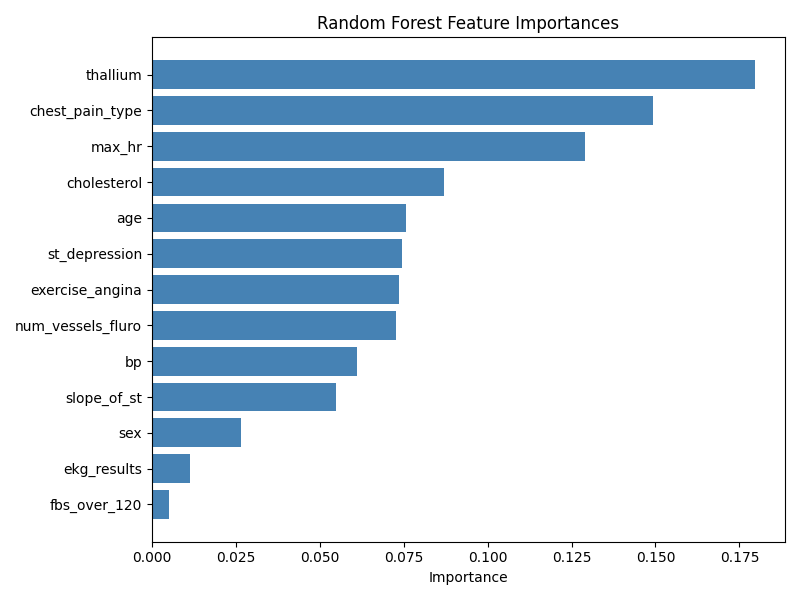

---

## 10. Modeling Recommendations

- **Primary metric:** ROC AUC throughout all CV and evaluation steps.
- **Encoding:** ordinal or target encoding for tree models; one-hot for linear models.
- **Scaling:** RobustScaler or StandardScaler for non-tree models.
- **Outliers:** winsorize or use RobustScaler — tree models don't require this.
- **Weak features:** monitor `bp` and `fbs_over_120`; drop if they hurt CV score.
- **Strong signal:** `thallium`, `chest_pain_type`, `num_vessels_fluro`, `exercise_angina`, `max_hr` — prioritize these in feature engineering.
- **Baseline target:** beat 0.9470 AUC with XGBoost/LightGBM + tuning.
